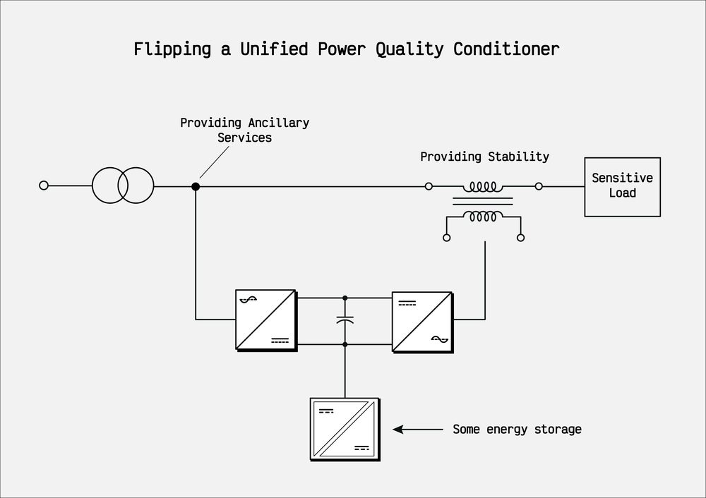
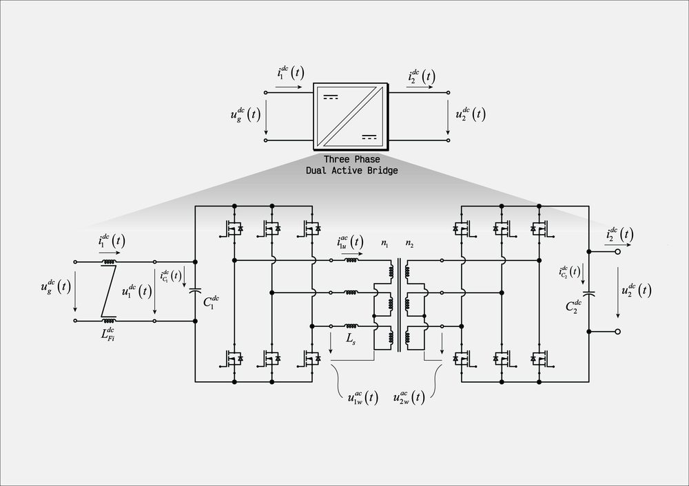
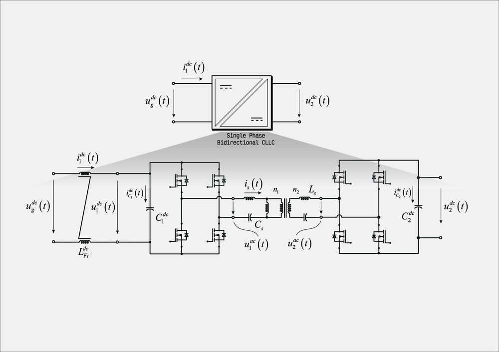
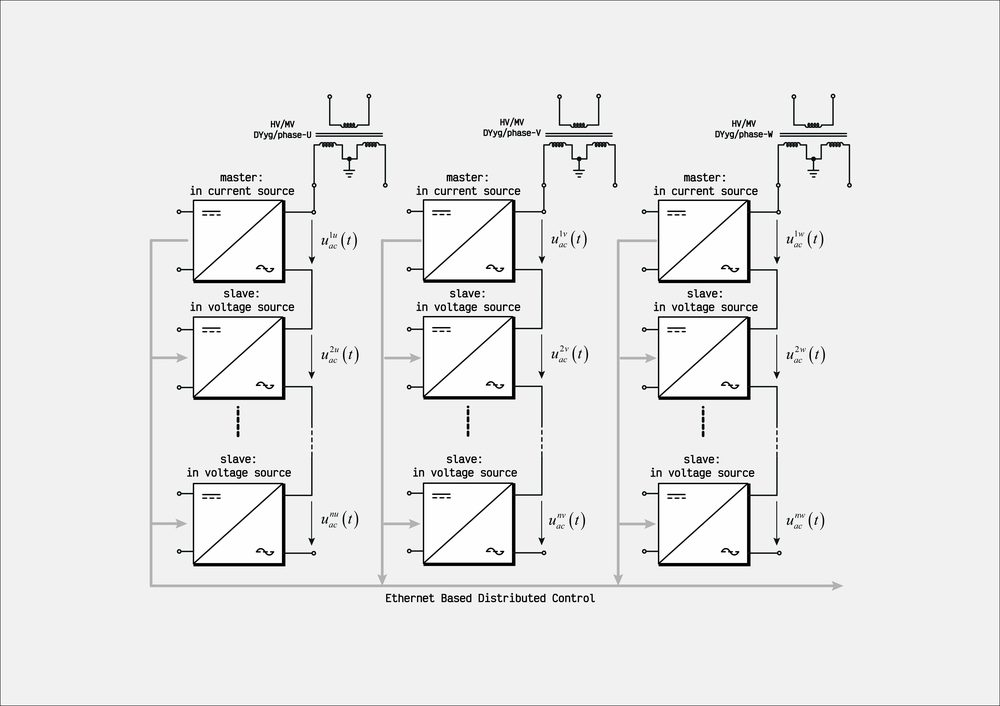
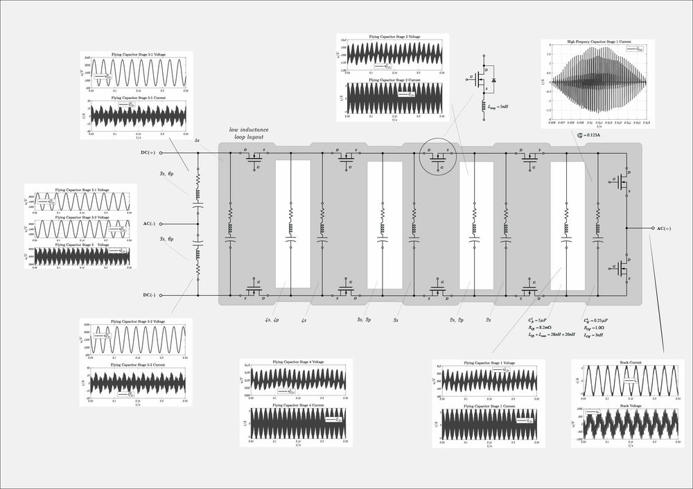
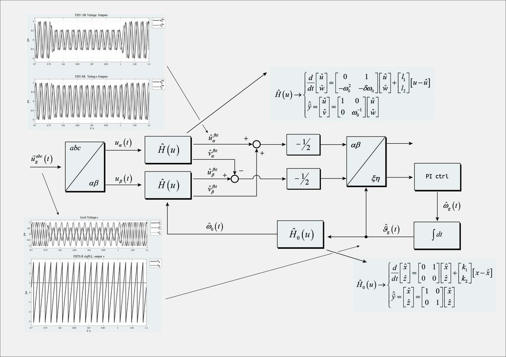

<p align="center">
  <a href="https://pwr-control.com"></a>
</p>

<h1 align="center">pwr-control</h1>

<p align="center"><strong>Power Electronics &amp; Control Systems Laboratory</strong></p>

<p align="center">
  Open MATLAB / Simulink / Simscape models of power converters, electrical machines and their control,<br>
  built to reproduce real operating conditions — from system level down to the switching devices.
</p>

<p align="center">
  
  
  
  <a href="https://pwr-control.com"></a>
  <a href="https://www.linkedin.com/in/davide-bagnara-633353290/"></a>
</p>

<p align="center">
  <a href="#start-here">Start here</a> &nbsp;·&nbsp;
  <a href="#repositories">Repositories</a> &nbsp;·&nbsp;
  <a href="#gallery">Gallery</a> &nbsp;·&nbsp;
  <a href="#videos">Videos</a> &nbsp;·&nbsp;
  <a href="#technical-notes">Technical notes</a> &nbsp;·&nbsp;
  <a href="#about">About</a>
</p>

---

The repositories in this account share one idea: a control strategy should be judged on realistic waveforms, not on idealised blocks. The models are therefore built in Simscape with custom components (semiconductors, magnetics with saturation, machines, batteries, fuel cells) and the control code is written in C where it would run on a real target. Every repository has its own README with setup instructions; the theory behind the models is collected in the [technical notes](#technical-notes) below.

## Start here

Every model depends on the shared **[library](https://github.com/pwr-control/library)** repository: Simscape components, masked Simulink blocks and the C code used by the C-Caller blocks. Set it up once and all the other repositories work out of the box.

1. Clone `library` and add it to the MATLAB path **with subfolders**.
2. Clone the repository you are interested in and run its setup script (each README says which one).
3. Open the Simulink model and simulate.

```bash
git clone https://github.com/pwr-control/library.git
git clone https://github.com/pwr-control/<repository>.git
```

```matlab
addpath(genpath('path/to/library'));   % once per session, or savepath to make it permanent
```

Requirements: MATLAB with Simulink, Simscape and Simscape Electrical.

## Repositories

| Area | Repository | What you will find |
|:--|:--|:--|
| Foundations | **[library](https://github.com/pwr-control/library)** | Simscape components, masked blocks and C code shared by all the other repositories. Add it to the MATLAB path first. |
| DC/DC converters | **[advanced-dcdc-converters](https://github.com/pwr-control/advanced-dcdc-converters)** | Single-phase DAB, three-phase DAB (DAB3) and resonant CLLC for the 250 kW class: Simscape benches, loss and harmonic analysis, resonant-tank optimisation. |
| Solid-state transformers | **[solid-state-transformers](https://github.com/pwr-control/solid-state-transformers)** | Modular SST made of isolated DC/DC stages (DAB or CLLC) and three-level T-type single-phase inverters, paralleled on the DC side and series-connected on the AC side; synchronised modulators with local time bases. |
| Power quality | **[left-shunt-unified-power-quality-conditioner](https://github.com/pwr-control/left-shunt-unified-power-quality-conditioner)** | Flipped UPQC (F-UPQC): the shunt converter provides grid services, the series converter stabilises the load voltage. Simscape bench plus the IEEE-format paper deriving model and control. |
| Grid-forming | **[grid-forming](https://github.com/pwr-control/grid-forming)** | Grid-forming control architectures, starting from how a grid-tied active front end behaves on progressively weaker grids. |
| Electrical machines | **[control-of-electrical-machine](https://github.com/pwr-control/control-of-electrical-machine)** | Sensorless PMSM control: SVPWM with dq PI or model-predictive current control, combined with a back-EMF observer, an EKF or a nonlinear observer. Induction machine to follow. |
| Adaptive control | **[adaptive-control](https://github.com/pwr-control/adaptive-control)** | Compact MATLAB/Simulink projects: MRAC on an active suspension and on textbook cases, harmonic-tracker analysis for grid signals, a coupled PDE/ODE thermal model. |
| Teaching | **[lectures-on-advanced-control-engineering](https://github.com/pwr-control/lectures-on-advanced-control-engineering)** | Worked lecture examples (MCI, 2019–2023, still updated): state-space design, observers, Kalman filtering, MPC and adaptive control applied to converters, drives, mechatronics and hydrostatic drivelines. |
| Teaching | **[advanced-control-engineering](https://github.com/pwr-control/advanced-control-engineering)** | LaTeX sources and compiled PDFs of the two companion textbooks, *Advanced Control Engineering* and *Electromechanical Devices*. |

## Gallery

<table width="100%">
  <tr>
    <td align="center" width="50%">
      <a href="https://github.com/pwr-control/left-shunt-unified-power-quality-conditioner"></a><br>
      <sub><b>Flipped UPQC</b> — shunt converter for ancillary services, series converter for load-voltage stability</sub>
    </td>
    <td align="center" width="50%">
      <a href="https://github.com/pwr-control/advanced-dcdc-converters"></a><br>
      <sub><b>Three-phase dual active bridge (DAB3)</b> — 250 kW class isolated DC/DC stage</sub>
    </td>
  </tr>
  <tr>
    <td align="center" width="50%">
      <a href="https://github.com/pwr-control/advanced-dcdc-converters"></a><br>
      <sub><b>Single-phase bidirectional CLLC</b> — resonant alternative to the DAB</sub>
    </td>
    <td align="center" width="50%">
      <a href="https://github.com/pwr-control/solid-state-transformers"></a><br>
      <sub><b>Solid-state transformer</b> — master/slave modules with Ethernet-based distributed control</sub>
    </td>
  </tr>
  <tr>
    <td align="center" width="50%">
      <a href="./docs/multilevel_flying_capacitors/single_phase_flying_capacitor_multilevel_inverter.pdf"></a><br>
      <sub><b>Flying-capacitor multilevel inverter</b> — single-phase, with pre-charge and modulation study</sub>
    </td>
    <td align="center" width="50%">
      <a href="./docs/single_phase_lock_loop/single_phase_pll.pdf"></a><br>
      <sub><b>First-harmonic-tracker dq-PLL</b> — single-phase grid synchronisation with an adaptive-filter VCO</sub>
    </td>
  </tr>
</table>

## Videos

<table width="100%">
  <tr>
    <td align="center" width="33%">
      <a href="https://www.youtube.com/watch?v=sjfaFL99E5s"></a><br>
      <sub><b>Three-phase DAB</b></sub>
    </td>
    <td align="center" width="33%">
      <a href="https://www.youtube.com/watch?v=2_LkWHoYVdM"></a><br>
      <sub><b>Flipped UPQC</b></sub>
    </td>
    <td align="center" width="33%">
      <a href="https://www.youtube.com/watch?v=6orHQiUX2Qk"></a><br>
      <sub><b>First-harmonic-tracker dq-PLL</b></sub>
    </td>
  </tr>
</table>

## Technical notes

Self-contained PDF notes (LaTeX) that document the models: derivations, control design and simulation results. They are the reference for the blocks in `library` and for the benches in the repositories above.

| Topic | Note | Pages |
|:--|:--|--:|
| Power electronics | [Flying Capacitor Multilevel Single-Phase Inverter](./docs/multilevel_flying_capacitors/single_phase_flying_capacitor_multilevel_inverter.pdf) | 22 |
| Power electronics | [Solid State Transformers: architecture, control and simulation results](./docs/solid_state_transformers/solid_state_transformers.pdf) | 31 |
| Power electronics | [Modularity: model and control architecture](./docs/modularity/modularity.pdf) — paralleled AFE drives, grid filter and power quality | 54 |
| Power electronics | [Single-Phase Lock Loop](./docs/single_phase_lock_loop/single_phase_pll.pdf) | 10 |
| Power electronics | [Three-Phase Inductors: mathematical model and construction](./docs/three_phase_inductors/three_phase_inductor_with_saturation_effects.pdf) — with saturation effects | 8 |
| Electrical machines | [PMSM: model and control strategies](./docs/pmsm_motor_model_and_control/pmsm_ctrl_vctrl_state_observers.pdf) — vector control and state observers | 29 |
| Electrical machines | [PMSM: vector control, EMF-based observer and parameter-mismatch analysis](./docs/pmsm_motor_model_and_control/bemf_observer_and_parameters_mismatch.pdf) | 10 |
| Electrical machines | [Induction Motor: modelization and parameter estimation](./docs/induction_motor_model_and_control/im_model_and_ctrl.pdf) | 49 |
| Energy sources | [Lithium-ion Battery](./docs/lithium_ion_battery/lithium_ion_battery.pdf) — equivalent-circuit model | 12 |
| Energy sources | [PEM Fuel Cell](./docs/pemfuelcell/permfc_simscape_model.pdf) — Simscape model | 26 |
| Control theory | [Nonlinear Observers: application to hydrostatic transmissions and electrical machinery](./docs/nonlinear_observers/nonlinear_observers.pdf) | 55 |
| Mechatronics | [Electrification of Heavy Duty Vehicles](./docs/electrification_heavy_duty_vehicle/ehd_ver1.pdf) | 77 |
| Mechatronics | [Hydrostatic Fluid Power Modelization](./docs/hydraulic_fluid_power/hydraulic_fluid_power.pdf) | 85 |
| Mechatronics | [Control of String-Actuated Systems](./docs/control_of_string_actuated/control-of-string-actuated.pdf) — following Wang/Krstic | 31 |
| Mechatronics | [Moving Coil: mathematical model and control](./docs/moving_coil/moving_coil.pdf) | 17 |
| Mechatronics | [Flexible Shaft Model](./docs/flexible_shaft/flexible_shaft_model.pdf) — torsional oscillations of a driveline | 8 |

## About

**Davide Bagnara** — power electronics and control systems engineer with twenty years of industrial R&D on high-power drives and grid-tied converters (250 kW – 1 MW), wide-bandgap devices, PMSM control and embedded firmware (STM32, TI C2000). Papers at PCIM Europe and ISIEA; patent on active damping for ropeway drive systems. Based in South Tyrol, Italy.

Everything here is personal research work, shared as is. If a model or a note is useful to you, a star helps others find it; questions and suggestions are welcome through the issues of the relevant repository.

<p align="center">
  <a href="https://pwr-control.com">pwr-control.com</a> &nbsp;·&nbsp;
  <a href="https://www.linkedin.com/in/davide-bagnara-633353290/">LinkedIn</a> &nbsp;·&nbsp;
  <a href="mailto:info@pwr-control.com">info@pwr-control.com</a>
</p>
